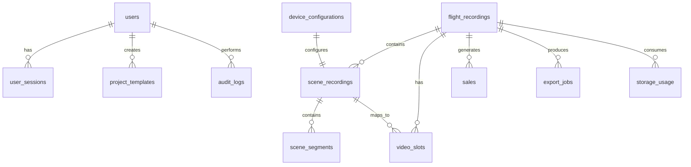

# MagnumStream Database Relationships & Architecture

## Table Relationships Overview



## Core Entity Relationships

### 1. Flight Recording (Main Entity)
**Primary Key**: `id` (VARCHAR, UUID)

**Relationships**:
- **ONE-TO-MANY** with `scene_recordings` (1 recording → 3 scenes)
- **ONE-TO-MANY** with `video_slots` (1 recording → 8 slots)
- **ONE-TO-MANY** with `sales` (1 recording → multiple sales)
- **ONE-TO-MANY** with `export_jobs` (1 recording → multiple exports)
- **ONE-TO-MANY** with `storage_usage` (1 recording → multiple files)

### 2. Scene Recording
**Primary Key**: `id` (VARCHAR, UUID)
**Foreign Key**: `recording_id` → `flight_recordings.id`

**Relationships**:
- **MANY-TO-ONE** with `flight_recordings` (scene belongs to recording)
- **ONE-TO-MANY** with `scene_segments` (1 scene → multiple segments)
- **ONE-TO-MANY** with `video_slots` (1 scene → multiple slots)

**Constraints**:
- Maximum 3 scenes per recording (cruising, chase, arrival)
- Each scene type must be unique per recording
- Scene index must be 1, 2, or 3

### 3. Scene Segments (New - Scene Editor)
**Primary Key**: `id` (VARCHAR, UUID)
**Foreign Key**: `scene_id` → `scene_recordings.id`

**Relationships**:
- **MANY-TO-ONE** with `scene_recordings` (segments belong to scene)

**Constraints**:
- Segment numbers must be unique per scene
- Start time must be non-negative
- Duration must be positive
- Camera angle must be 1 or 2

### 4. Video Slots (8-Slot Template)
**Primary Key**: `id` (VARCHAR, UUID)
**Foreign Keys**: 
- `recording_id` → `flight_recordings.id`
- `scene_id` → `scene_recordings.id`

**Relationships**:
- **MANY-TO-ONE** with `flight_recordings` (slot belongs to recording)
- **MANY-TO-ONE** with `scene_recordings` (slot references scene)

**Constraints**:
- Exactly 8 slots per recording (slot_number 1-8)
- Each slot number must be unique per recording
- Window start and duration must be positive

### 5. Sales
**Primary Key**: `id` (VARCHAR, UUID)
**Foreign Key**: `recording_id` → `flight_recordings.id`

**Relationships**:
- **MANY-TO-ONE** with `flight_recordings` (sales belong to recording)

**Constraints**:
- Bundle must be one of: 'video_photos', 'video_only', 'video_airtour_photos'
- Sale amount must be positive (if provided)

## Data Flow & Business Logic

### Scene Editor Workflow
```
1. Flight Recording Created
   ↓
2. 3 Scene Recordings Created (cruising, chase, arrival)
   ↓
3. Scene Segments Created (via Scene Editor)
   ↓ 
4. Video Slots Configured (8-slot template)
   ↓
5. Export Job Created
   ↓
6. Final Video Generated
```

### Camera Source Management
```
Device Configuration (Default: front/rear)
   ↓
Scene Recording (camera1_source, camera2_source)
   ↓
Scene Segments (camera_angle: 1 or 2)
   ↓
Video Slots (camera_angle maps to source)
```

## Indexing Strategy

### Primary Indexes (Performance Critical)
```sql
-- Query recordings by date/status
CREATE INDEX idx_flight_recordings_created_at ON flight_recordings(created_at DESC);
CREATE INDEX idx_flight_recordings_export_status ON flight_recordings(export_status);

-- Scene editor queries
CREATE INDEX idx_scene_segments_scene_id ON scene_segments(scene_id);
CREATE INDEX idx_scene_segments_start_time ON scene_segments(start_time);

-- Video slot template queries  
CREATE INDEX idx_video_slots_recording_id ON video_slots(recording_id);
CREATE INDEX idx_video_slots_slot_number ON video_slots(slot_number);

-- Sales analytics
CREATE INDEX idx_sales_sale_date ON sales(sale_date DESC);
CREATE INDEX idx_sales_staff_member ON sales(staff_member);
```

### Composite Indexes (Multi-column Queries)
```sql
-- Scene lookup by recording and type
CREATE INDEX idx_scene_recordings_recording_type ON scene_recordings(recording_id, scene_type);

-- Segment timeline queries
CREATE INDEX idx_scene_segments_scene_start ON scene_segments(scene_id, start_time);

-- Video slot configuration
CREATE INDEX idx_video_slots_scene_slot ON video_slots(scene_id, slot_number);
```

### Partial Indexes (Filtered Queries)
```sql
-- Unsold recordings (dashboard view)
CREATE INDEX idx_flight_recordings_unsold ON flight_recordings(created_at DESC) 
WHERE sold = false;

-- Active export jobs
CREATE INDEX idx_export_jobs_active ON export_jobs(created_at DESC) 
WHERE status IN ('pending', 'processing');
```

## Data Integrity & Constraints

### Foreign Key Constraints
All tables use `CASCADE DELETE` for cleanup:
- Deleting a recording removes all scenes, slots, sales, exports
- Deleting a scene removes all segments and related slots
- User deletion removes sessions but preserves created content

### Check Constraints
```sql
-- Scene types validation
CONSTRAINT chk_scene_type CHECK (scene_type IN ('cruising', 'chase', 'arrival'))

-- Camera angles validation  
CONSTRAINT chk_camera_angle CHECK (camera_angle IN (1, 2))

-- Slot numbers validation
CONSTRAINT chk_slot_number CHECK (slot_number >= 1 AND slot_number <= 8)

-- Positive values validation
CONSTRAINT chk_positive_duration CHECK (duration > 0)
CONSTRAINT chk_positive_start_time CHECK (start_time >= 0)
```

### Unique Constraints
```sql
-- Prevent duplicate scenes per recording
CONSTRAINT uk_scene_recordings_recording_scene UNIQUE (recording_id, scene_type, scene_index)

-- Prevent duplicate slots per recording
CONSTRAINT uk_video_slots_recording_slot UNIQUE (recording_id, slot_number)

-- Prevent duplicate segments per scene
CONSTRAINT uk_scene_segments_scene_segment UNIQUE (scene_id, segment_number)
```

## Security & Row Level Security (RLS)

### Enabled Tables
- `users` - Users can only access their own records
- `user_sessions` - Sessions tied to user
- `flight_recordings` - Open access (can be restricted per organization)
- `sales` - Open access (can be restricted per staff member)

### Sample RLS Policies
```sql
-- Users can only see their own data
CREATE POLICY users_policy ON users
    FOR ALL USING (id = current_setting('app.current_user_id', true)::varchar);

-- Staff can see recordings they created or are assigned to
CREATE POLICY flight_recordings_staff_policy ON flight_recordings
    FOR ALL USING (
        staff_member = current_setting('app.current_user_name', true) OR
        created_by = current_setting('app.current_user_id', true)::varchar
    );
```

## Performance Considerations

### Query Optimization
1. **Recording Dashboard**: Use `recording_summary` view for aggregated data
2. **Scene Editor**: Fetch scene + segments in single query with JOIN
3. **Video Timeline**: Use segment start_time index for timeline scrubbing
4. **Sales Analytics**: Leverage date-partitioned indexes

### Storage Optimization
1. **JSONB Columns**: Use for flexible configuration storage (templates, metadata)
2. **Partial Indexes**: For frequently filtered queries (unsold, active exports)
3. **Archival Strategy**: Move old audit logs to separate partition

### Caching Strategy
1. **Project Templates**: Cache default slot configurations
2. **Device Configurations**: Cache active camera setups
3. **Export Status**: Cache job progress for real-time updates

## Migration Considerations

### Schema Versioning
```sql
CREATE TABLE schema_version (
    version INTEGER PRIMARY KEY,
    applied_at TIMESTAMP WITH TIME ZONE DEFAULT NOW()
);
```

### Backwards Compatibility
- `video_slots.slot_duration` changed from fixed 3s to variable
- `scene_recordings` added camera source fields with defaults
- New tables added without affecting existing functionality

### Data Migration Scripts
```sql
-- Migrate existing slots to variable duration
UPDATE video_slots SET slot_duration = 3.0 WHERE slot_duration IS NULL;

-- Set default camera sources for existing scenes
UPDATE scene_recordings 
SET camera1_source = 'front', camera2_source = 'rear' 
WHERE camera1_source IS NULL;
```

## Monitoring & Maintenance

### Automatic Cleanup
```sql
-- Clean expired sessions
CREATE OR REPLACE FUNCTION cleanup_expired_sessions()
-- Clean old audit logs (90 days)
CREATE OR REPLACE FUNCTION cleanup_old_audit_logs()
```

### Storage Monitoring
```sql
-- Track storage usage per recording
CREATE OR REPLACE FUNCTION get_recording_storage_usage(recording_uuid VARCHAR)
-- Monitor total database size
SELECT pg_size_pretty(pg_database_size(current_database()));
```

### Performance Monitoring
- Monitor slow queries on scene editor timeline operations
- Track export job completion rates
- Alert on storage growth rates

## Backup & Recovery

### Critical Tables (Priority 1)
- `flight_recordings` - Core business data
- `scene_recordings` - Video metadata
- `sales` - Revenue data

### Configurable Tables (Priority 2)  
- `scene_segments` - Recreatable from UI
- `video_slots` - Regeneratable from templates
- `project_templates` - Has defaults

### System Tables (Priority 3)
- `audit_logs` - Historical data
- `storage_usage` - Analytics only
- `export_jobs` - Temporary job status

This schema provides a robust foundation for the MagnumStream platform with room for future expansion while maintaining data integrity and performance.