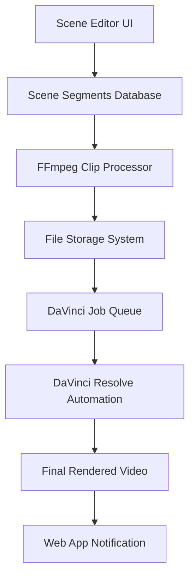

# Scene Cutting & DaVinci Resolve Integration Plan

## Overview
Complete workflow for cutting scenes in your web application using FFmpeg and feeding pre-cut clips into DaVinci Resolve for final video production.

## Architecture Flow



## Part 1: FFmpeg Scene Cutting Integration

### 1.1 Enhanced Database Schema

Add to your existing schema:

```sql
-- Clip generation jobs table
CREATE TABLE clip_jobs (
    id VARCHAR PRIMARY KEY DEFAULT uuid_generate_v4(),
    recording_id VARCHAR NOT NULL,
    scene_id VARCHAR NOT NULL,
    segment_id VARCHAR NOT NULL,
    status TEXT NOT NULL DEFAULT 'pending', -- 'pending' | 'processing' | 'completed' | 'failed'
    ffmpeg_command TEXT,
    input_file_path TEXT NOT NULL,
    output_file_path TEXT,
    file_size_bytes BIGINT,
    duration_seconds DECIMAL(8,2),
    error_message TEXT,
    created_at TIMESTAMP WITH TIME ZONE DEFAULT NOW(),
    started_at TIMESTAMP WITH TIME ZONE,
    completed_at TIMESTAMP WITH TIME ZONE,
    
    CONSTRAINT fk_clip_jobs_recording_id 
        FOREIGN KEY (recording_id) REFERENCES flight_recordings(id) ON DELETE CASCADE,
    CONSTRAINT fk_clip_jobs_scene_id 
        FOREIGN KEY (scene_id) REFERENCES scene_recordings(id) ON DELETE CASCADE,
    CONSTRAINT fk_clip_jobs_segment_id 
        FOREIGN KEY (segment_id) REFERENCES scene_segments(id) ON DELETE CASCADE
);

-- DaVinci Resolve jobs table  
CREATE TABLE davinci_jobs (
    id VARCHAR PRIMARY KEY DEFAULT uuid_generate_v4(),
    recording_id VARCHAR NOT NULL,
    status TEXT NOT NULL DEFAULT 'pending', -- 'pending' | 'processing' | 'rendering' | 'completed' | 'failed'
    job_file_path TEXT, -- Path to JSON job file for DaVinci
    render_output_path TEXT,
    progress_percentage INTEGER DEFAULT 0,
    davinci_job_id TEXT, -- DaVinci's internal job ID
    error_message TEXT,
    metadata JSONB, -- Store additional project info
    created_at TIMESTAMP WITH TIME ZONE DEFAULT NOW(),
    started_at TIMESTAMP WITH TIME ZONE,
    completed_at TIMESTAMP WITH TIME ZONE,
    
    CONSTRAINT fk_davinci_jobs_recording_id 
        FOREIGN KEY (recording_id) REFERENCES flight_recordings(id) ON DELETE CASCADE
);
```

### 1.2 FFmpeg Clip Processor Service

```typescript
// /server/services/ClipProcessor.ts
import { exec } from 'child_process';
import { promisify } from 'util';
import path from 'path';
import fs from 'fs/promises';
import { db } from '../db';
import { clipJobs, sceneSegments, sceneRecordings } from '@shared/schema';

const execAsync = promisify(exec);

export interface ClipProcessingJob {
  segmentId: string;
  sceneId: string;
  recordingId: string;
  inputCameraUrl: string;
  startTime: number;
  duration: number;
  cameraAngle: 1 | 2;
  outputFileName: string;
}

export class ClipProcessor {
  private readonly CLIPS_OUTPUT_DIR = process.env.CLIPS_OUTPUT_DIR || './storage/clips';
  private readonly MAX_CONCURRENT_JOBS = 3;
  private currentJobs: Set<string> = new Set();

  constructor() {
    this.ensureOutputDirectory();
  }

  private async ensureOutputDirectory() {
    await fs.mkdir(this.CLIPS_OUTPUT_DIR, { recursive: true });
  }

  async processSceneSegments(recordingId: string): Promise<boolean> {
    try {
      // Get all scene segments for this recording
      const segments = await db
        .select({
          segmentId: sceneSegments.id,
          sceneId: sceneSegments.sceneId,
          startTime: sceneSegments.startTime,
          duration: sceneSegments.duration,
          cameraAngle: sceneSegments.cameraAngle,
          segmentNumber: sceneSegments.segmentNumber,
          camera1Url: sceneRecordings.camera1Url,
          camera2Url: sceneRecordings.camera2Url,
          sceneType: sceneRecordings.sceneType,
        })
        .from(sceneSegments)
        .innerJoin(sceneRecordings, eq(sceneSegments.sceneId, sceneRecordings.id))
        .where(eq(sceneRecordings.recordingId, recordingId));

      // Create clip jobs for each segment
      const clipJobs = segments.map(segment => ({
        segmentId: segment.segmentId,
        sceneId: segment.sceneId,
        recordingId,
        inputCameraUrl: segment.cameraAngle === 1 ? segment.camera1Url : segment.camera2Url,
        startTime: segment.startTime,
        duration: segment.duration,
        cameraAngle: segment.cameraAngle,
        outputFileName: `${recordingId}_${segment.sceneType}_seg${segment.segmentNumber}_cam${segment.cameraAngle}.mp4`
      }));

      // Process clips in batches
      await this.processBatch(clipJobs);
      
      return true;
    } catch (error) {
      console.error('Error processing scene segments:', error);
      return false;
    }
  }

  private async processBatch(jobs: ClipProcessingJob[]) {
    const batches = this.chunkArray(jobs, this.MAX_CONCURRENT_JOBS);
    
    for (const batch of batches) {
      await Promise.all(batch.map(job => this.processClip(job)));
    }
  }

  private async processClip(job: ClipProcessingJob): Promise<string | null> {
    const jobId = crypto.randomUUID();
    
    try {
      this.currentJobs.add(jobId);
      
      // Create database record
      const [clipJob] = await db
        .insert(clipJobs)
        .values({
          recordingId: job.recordingId,
          sceneId: job.sceneId,
          segmentId: job.segmentId,
          inputFilePath: job.inputCameraUrl,
          status: 'processing',
          startedAt: new Date(),
        })
        .returning();

      const outputPath = path.join(this.CLIPS_OUTPUT_DIR, job.outputFileName);
      
      // Build FFmpeg command for precise cutting
      const ffmpegCommand = this.buildFFmpegCommand(
        job.inputCameraUrl,
        job.startTime,
        job.duration,
        outputPath
      );

      // Update job with command
      await db
        .update(clipJobs)
        .set({ ffmpegCommand })
        .where(eq(clipJobs.id, clipJob.id));

      // Execute FFmpeg
      console.log(`Processing clip: ${job.outputFileName}`);
      const { stdout, stderr } = await execAsync(ffmpegCommand);

      // Get file stats
      const stats = await fs.stat(outputPath);
      
      // Update job as completed
      await db
        .update(clipJobs)
        .set({
          status: 'completed',
          outputFilePath: outputPath,
          fileSizeBytes: stats.size,
          durationSeconds: job.duration,
          completedAt: new Date(),
        })
        .where(eq(clipJobs.id, clipJob.id));

      console.log(`Completed clip: ${job.outputFileName}`);
      return outputPath;

    } catch (error) {
      console.error(`Error processing clip ${job.outputFileName}:`, error);
      
      // Update job as failed
      await db
        .update(clipJobs)
        .set({
          status: 'failed',
          errorMessage: error.message,
          completedAt: new Date(),
        })
        .where(eq(clipJobs.segmentId, job.segmentId));

      return null;
    } finally {
      this.currentJobs.delete(jobId);
    }
  }

  private buildFFmpegCommand(
    inputPath: string,
    startTime: number,
    duration: number,
    outputPath: string
  ): string {
    // Build high-precision FFmpeg command
    return [
      'ffmpeg',
      '-y', // Overwrite output files
      '-i', `"${inputPath}"`, // Input file
      '-ss', startTime.toString(), // Start time in seconds
      '-t', duration.toString(), // Duration in seconds
      '-c:v', 'libx264', // Video codec
      '-c:a', 'aac', // Audio codec
      '-crf', '18', // High quality
      '-preset', 'fast', // Encoding speed
      '-avoid_negative_ts', 'make_zero', // Handle timestamp issues
      '-accurate_seek', // Precise seeking
      `"${outputPath}"` // Output file
    ].join(' ');
  }

  private chunkArray<T>(array: T[], size: number): T[][] {
    const chunks: T[][] = [];
    for (let i = 0; i < array.length; i += size) {
      chunks.push(array.slice(i, i + size));
    }
    return chunks;
  }

  async getProcessingStatus(recordingId: string) {
    const jobs = await db
      .select()
      .from(clipJobs)
      .where(eq(clipJobs.recordingId, recordingId));

    const total = jobs.length;
    const completed = jobs.filter(j => j.status === 'completed').length;
    const failed = jobs.filter(j => j.status === 'failed').length;
    const processing = jobs.filter(j => j.status === 'processing').length;

    return {
      total,
      completed,
      failed,
      processing,
      percentage: total > 0 ? Math.round((completed / total) * 100) : 0,
      status: completed === total ? 'completed' : 
               failed > 0 ? 'partial_failure' : 
               processing > 0 ? 'processing' : 'pending'
    };
  }
}
```

### 1.3 API Integration

```typescript
// /server/routes.ts - Add new endpoints
app.post("/api/recordings/:id/process-clips", async (req, res) => {
  try {
    const recordingId = req.params.id;
    const clipProcessor = new ClipProcessor();
    
    const success = await clipProcessor.processSceneSegments(recordingId);
    
    if (success) {
      res.json({ success: true, message: "Clip processing started" });
    } else {
      res.status(500).json({ error: "Failed to start clip processing" });
    }
  } catch (error) {
    res.status(500).json({ error: error.message });
  }
});

app.get("/api/recordings/:id/clip-status", async (req, res) => {
  try {
    const recordingId = req.params.id;
    const clipProcessor = new ClipProcessor();
    
    const status = await clipProcessor.getProcessingStatus(recordingId);
    res.json(status);
  } catch (error) {
    res.status(500).json({ error: error.message });
  }
});
```

## Part 2: Enhanced DaVinci Resolve Integration

### 2.1 Updated DaVinci Job Generator

```typescript
// /server/services/DaVinciJobGenerator.ts
import path from 'path';
import fs from 'fs/promises';
import { db } from '../db';
import { davinciJobs, clipJobs, sceneSegments, flightRecordings } from '@shared/schema';

export class DaVinciJobGenerator {
  private readonly DAVINCI_QUEUE_DIR = process.env.DAVINCI_QUEUE_DIR || './storage/davinci_queue';
  private readonly DAVINCI_OUTPUT_DIR = process.env.DAVINCI_OUTPUT_DIR || './storage/renders';

  constructor() {
    this.ensureDirectories();
  }

  private async ensureDirectories() {
    await fs.mkdir(this.DAVINCI_QUEUE_DIR, { recursive: true });
    await fs.mkdir(this.DAVINCI_OUTPUT_DIR, { recursive: true });
  }

  async createDaVinciJob(recordingId: string): Promise<boolean> {
    try {
      // Check if all clips are ready
      const clipStatus = await this.getClipReadiness(recordingId);
      if (!clipStatus.allReady) {
        throw new Error(`Not all clips are ready: ${clipStatus.summary}`);
      }

      // Get flight recording info
      const [recording] = await db
        .select()
        .from(flightRecordings)
        .where(eq(flightRecordings.id, recordingId));

      if (!recording) {
        throw new Error('Recording not found');
      }

      // Get all completed clips organized by slot
      const clips = await this.getOrganizedClips(recordingId);

      // Generate DaVinci job data
      const jobData = this.generateJobData(recording, clips);

      // Create database record
      const [davinciJob] = await db
        .insert(davinciJobs)
        .values({
          recordingId,
          status: 'pending',
          metadata: jobData,
        })
        .returning();

      // Write job file for DaVinci watcher
      const jobFileName = `${recordingId}_${Date.now()}.json`;
      const jobFilePath = path.join(this.DAVINCI_QUEUE_DIR, jobFileName);
      
      await fs.writeFile(jobFilePath, JSON.stringify(jobData, null, 2));

      // Update database with file path
      await db
        .update(davinciJobs)
        .set({ jobFilePath })
        .where(eq(davinciJobs.id, davinciJob.id));

      console.log(`Created DaVinci job: ${jobFileName}`);
      return true;

    } catch (error) {
      console.error('Error creating DaVinci job:', error);
      return false;
    }
  }

  private async getClipReadiness(recordingId: string) {
    const clips = await db
      .select()
      .from(clipJobs)
      .where(eq(clipJobs.recordingId, recordingId));

    const total = clips.length;
    const completed = clips.filter(c => c.status === 'completed').length;
    const failed = clips.filter(c => c.status === 'failed').length;

    return {
      allReady: completed === total && failed === 0,
      total,
      completed,
      failed,
      summary: `${completed}/${total} completed, ${failed} failed`
    };
  }

  private async getOrganizedClips(recordingId: string) {
    const clips = await db
      .select({
        segmentNumber: sceneSegments.segmentNumber,
        sceneType: sceneRecordings.sceneType,
        cameraAngle: sceneSegments.cameraAngle,
        outputFilePath: clipJobs.outputFilePath,
        duration: sceneSegments.duration,
        startTime: sceneSegments.startTime,
      })
      .from(clipJobs)
      .innerJoin(sceneSegments, eq(clipJobs.segmentId, sceneSegments.id))
      .innerJoin(sceneRecordings, eq(clipJobs.sceneId, sceneRecordings.id))
      .where(
        and(
          eq(clipJobs.recordingId, recordingId),
          eq(clipJobs.status, 'completed')
        )
      )
      .orderBy(sceneSegments.segmentNumber);

    // Organize clips into the 8-slot format expected by DaVinci
    const organizedClips = {};
    clips.forEach((clip, index) => {
      const slotNumber = index + 1;
      organizedClips[slotNumber] = {
        filename: path.basename(clip.outputFilePath),
        full_path: clip.outputFilePath,
        scene_type: clip.sceneType,
        camera_angle: clip.cameraAngle,
        duration_seconds: clip.duration,
        in_point: 0, // Already cut to exact timing
        out_point: Math.round(clip.duration * 30), // Assume 30fps
      };
    });

    return organizedClips;
  }

  private generateJobData(recording: any, clips: any) {
    const timestamp = new Date().toISOString().replace(/[:.]/g, '-');
    const projectName = `${recording.pilotName.replace(/\s+/g, '_')}_${timestamp}`;

    return {
      job_id: crypto.randomUUID(),
      project_name: projectName,
      patron_name: recording.pilotName,
      pilot_email: recording.pilotEmail,
      flight_date: recording.flightDate,
      flight_time: recording.flightTime,
      staff_member: recording.staffMember,
      clips,
      render_settings: {
        format: "mp4",
        quality: "high",
        resolution: "1920x1080",
        frame_rate: "30",
        watermark: false,
        output_filename: `${projectName}_Final.mp4`
      },
      metadata: {
        recording_id: recording.id,
        total_clips: Object.keys(clips).length,
        created_at: new Date().toISOString(),
      }
    };
  }
}
```

### 2.2 Updated DaVinci Python Script

Update your existing `Davinci.py` with these enhancements:

```python
# Add to the beginning of Davinci.py after imports
import requests
from typing import Dict, List, Optional

# Add to CONFIGURATION section
# Web App Integration
WEB_APP_BASE_URL = "http://localhost:5000"  # Your web app URL
WEBHOOK_TOKEN = "your_webhook_secret_token"  # For security

# Update the _notify_completion method in JobWatcher class
def _notify_completion(self, project_name: str, job_data: Dict):
    """Notify web app that rendering is complete"""
    try:
        # Extract recording ID from job metadata
        recording_id = job_data.get('metadata', {}).get('recording_id')
        
        payload = {
            "recording_id": recording_id,
            "project_name": project_name,
            "status": "completed",
            "output_path": str(OUTPUT_FOLDER / f"{project_name}_Final.mp4"),
            "render_date": datetime.now().isoformat(),
            "token": WEBHOOK_TOKEN
        }
        
        response = requests.post(
            f"{WEB_APP_BASE_URL}/api/davinci/webhook",
            json=payload,
            timeout=30
        )
        
        if response.status_code == 200:
            logger.info(f"Successfully notified web app for {project_name}")
        else:
            logger.warning(f"Web app notification failed: {response.status_code}")
            
    except Exception as e:
        logger.error(f"Failed to notify web app: {e}")

# Add error notification method
def _notify_error(self, project_name: str, error_message: str, job_data: Dict):
    """Notify web app that rendering failed"""
    try:
        recording_id = job_data.get('metadata', {}).get('recording_id')
        
        payload = {
            "recording_id": recording_id,
            "project_name": project_name,
            "status": "failed",
            "error": error_message,
            "render_date": datetime.now().isoformat(),
            "token": WEBHOOK_TOKEN
        }
        
        requests.post(
            f"{WEB_APP_BASE_URL}/api/davinci/webhook",
            json=payload,
            timeout=30
        )
        
    except Exception as e:
        logger.error(f"Failed to notify error to web app: {e}")

# Update the watch method to include error notifications
def watch(self):
    """Main watch loop with enhanced error handling"""
    logger.info(f"Watching folder: {self.watch_folder}")
    
    while True:
        try:
            job_files = list(self.watch_folder.glob("*.json"))
            
            for job_file in job_files:
                logger.info(f"Found new job: {job_file.name}")
                
                with open(job_file, 'r') as f:
                    job_data = json.load(f)
                
                if self.automation.process_job(job_data):
                    completed_path = Path(COMPLETED_FOLDER) / job_file.name
                    shutil.move(str(job_file), str(completed_path))
                    self._notify_completion(job_data['project_name'], job_data)
                else:
                    error_path = job_file.with_suffix('.error')
                    job_file.rename(error_path)
                    self._notify_error(
                        job_data['project_name'], 
                        "DaVinci processing failed", 
                        job_data
                    )
            
            time.sleep(5)
            
        except KeyboardInterrupt:
            logger.info("Stopping job watcher...")
            break
        except Exception as e:
            logger.error(f"Error in watch loop: {e}")
            time.sleep(10)
```

### 2.3 Web App Webhook Handler

```typescript
// /server/routes.ts - Add webhook endpoint
app.post("/api/davinci/webhook", async (req, res) => {
  try {
    const { recording_id, project_name, status, output_path, error, token } = req.body;
    
    // Verify webhook token
    if (token !== process.env.DAVINCI_WEBHOOK_TOKEN) {
      return res.status(401).json({ error: "Invalid token" });
    }

    // Update DaVinci job status
    await db
      .update(davinciJobs)
      .set({
        status,
        renderOutputPath: output_path,
        errorMessage: error,
        completedAt: new Date(),
        progressPercentage: status === 'completed' ? 100 : 0,
      })
      .where(eq(davinciJobs.recordingId, recording_id));

    // Update flight recording status
    if (status === 'completed') {
      await db
        .update(flightRecordings)
        .set({
          exportStatus: 'completed',
          driveFileUrl: output_path, // Update with actual storage URL
        })
        .where(eq(flightRecordings.id, recording_id));
    } else if (status === 'failed') {
      await db
        .update(flightRecordings)
        .set({ exportStatus: 'failed' })
        .where(eq(flightRecordings.id, recording_id));
    }

    res.json({ success: true });
  } catch (error) {
    console.error('Webhook error:', error);
    res.status(500).json({ error: error.message });
  }
});
```

## Part 3: UI Integration

### 3.1 Processing Status Component

```typescript
// /client/src/components/ProcessingStatus.tsx
import { useState, useEffect } from 'react';
import { Progress } from '@/components/ui/progress';
import { Button } from '@/components/ui/button';
import { AlertCircle, CheckCircle, Clock, Download } from 'lucide-react';

interface ProcessingStatusProps {
  recordingId: string;
}

export default function ProcessingStatus({ recordingId }: ProcessingStatusProps) {
  const [clipStatus, setClipStatus] = useState(null);
  const [davinciStatus, setDavinciStatus] = useState(null);
  const [polling, setPolling] = useState(false);

  useEffect(() => {
    if (polling) {
      const interval = setInterval(fetchStatus, 2000);
      return () => clearInterval(interval);
    }
  }, [polling, recordingId]);

  const fetchStatus = async () => {
    try {
      const [clipRes, davinciRes] = await Promise.all([
        fetch(`/api/recordings/${recordingId}/clip-status`),
        fetch(`/api/recordings/${recordingId}/davinci-status`)
      ]);

      setClipStatus(await clipRes.json());
      setDavinciStatus(await davinciRes.json());

      // Stop polling if everything is complete
      if (clipRes.status === 'completed' && davinciRes.status === 'completed') {
        setPolling(false);
      }
    } catch (error) {
      console.error('Error fetching status:', error);
    }
  };

  const startProcessing = async () => {
    try {
      setPolling(true);
      await fetch(`/api/recordings/${recordingId}/process-clips`, { method: 'POST' });
      fetchStatus();
    } catch (error) {
      console.error('Error starting processing:', error);
      setPolling(false);
    }
  };

  const startDaVinciRender = async () => {
    try {
      await fetch(`/api/recordings/${recordingId}/create-davinci-job`, { method: 'POST' });
      fetchStatus();
    } catch (error) {
      console.error('Error starting DaVinci render:', error);
    }
  };

  return (
    <div className="space-y-6 p-6 bg-card rounded-lg border">
      <h3 className="text-lg font-semibold">Video Processing Status</h3>

      {/* Clip Processing Status */}
      <div className="space-y-3">
        <div className="flex items-center justify-between">
          <h4 className="font-medium">Scene Clip Generation</h4>
          {!clipStatus && (
            <Button onClick={startProcessing} size="sm">
              Start Processing
            </Button>
          )}
        </div>

        {clipStatus && (
          <>
            <Progress value={clipStatus.percentage} className="w-full" />
            <div className="flex items-center justify-between text-sm">
              <span>
                {clipStatus.completed}/{clipStatus.total} clips completed
              </span>
              <div className="flex items-center gap-2">
                {clipStatus.status === 'completed' ? (
                  <><CheckCircle className="w-4 h-4 text-green-500" /> Complete</>
                ) : clipStatus.status === 'processing' ? (
                  <><Clock className="w-4 h-4 text-blue-500" /> Processing</>
                ) : clipStatus.failed > 0 ? (
                  <><AlertCircle className="w-4 h-4 text-red-500" /> {clipStatus.failed} Failed</>
                ) : null}
              </div>
            </div>
          </>
        )}
      </div>

      {/* DaVinci Processing Status */}
      <div className="space-y-3">
        <div className="flex items-center justify-between">
          <h4 className="font-medium">Final Video Rendering</h4>
          {clipStatus?.status === 'completed' && !davinciStatus && (
            <Button onClick={startDaVinciRender} size="sm">
              Start Render
            </Button>
          )}
        </div>

        {davinciStatus && (
          <>
            <Progress value={davinciStatus.progress_percentage || 0} className="w-full" />
            <div className="flex items-center justify-between text-sm">
              <span>Status: {davinciStatus.status}</span>
              <div className="flex items-center gap-2">
                {davinciStatus.status === 'completed' ? (
                  <Button size="sm" variant="outline">
                    <Download className="w-4 h-4 mr-2" />
                    Download
                  </Button>
                ) : davinciStatus.status === 'failed' ? (
                  <><AlertCircle className="w-4 h-4 text-red-500" /> Failed</>
                ) : (
                  <><Clock className="w-4 h-4 text-blue-500" /> {davinciStatus.status}</>
                )}
              </div>
            </div>
          </>
        )}
      </div>
    </div>
  );
}
```

### 3.2 Integration in Scene Editor

```typescript
// Add to SceneEditor.tsx
import ProcessingStatus from '@/components/ProcessingStatus';

// Add to the SceneEditor component after export button
<ProcessingStatus recordingId={sceneId} />
```

## Part 4: File Management & Storage

### 4.1 Directory Structure

```
/storage/
├── scenes/           # Original scene recordings
├── clips/           # Generated individual clips
├── davinci_queue/   # JSON job files for DaVinci
├── renders/         # Final rendered videos
└── completed/       # Processed job files
```

### 4.2 Cleanup Service

```typescript
// /server/services/CleanupService.ts
export class CleanupService {
  // Clean up old clip files after successful render
  async cleanupCompletedJob(recordingId: string) {
    const cutoffs = {
      clips: 7 * 24 * 60 * 60 * 1000, // 7 days
      jobs: 30 * 24 * 60 * 60 * 1000, // 30 days
    };

    // Delete old clip files
    const oldClips = await db
      .select()
      .from(clipJobs)
      .where(
        and(
          eq(clipJobs.recordingId, recordingId),
          lt(clipJobs.completedAt, new Date(Date.now() - cutoffs.clips))
        )
      );

    for (const clip of oldClips) {
      if (clip.outputFilePath) {
        await fs.unlink(clip.outputFilePath).catch(() => {});
      }
    }

    // Clean up database records
    await db
      .delete(clipJobs)
      .where(
        and(
          eq(clipJobs.recordingId, recordingId),
          lt(clipJobs.completedAt, new Date(Date.now() - cutoffs.jobs))
        )
      );
  }
}
```

## Summary

This implementation provides:

1. **FFmpeg Integration**: Precise scene cutting within your web application
2. **Automated Workflow**: Seamless transition from scene editor to final video
3. **DaVinci Integration**: Enhanced Python script with webhook notifications
4. **Real-time Status**: Live updates on processing progress
5. **Error Handling**: Comprehensive error tracking and recovery
6. **File Management**: Organized storage and cleanup processes

The workflow ensures that users can edit scenes in your web app, automatically generate precise clips, and have them seamlessly integrated into DaVinci Resolve for professional final video production.